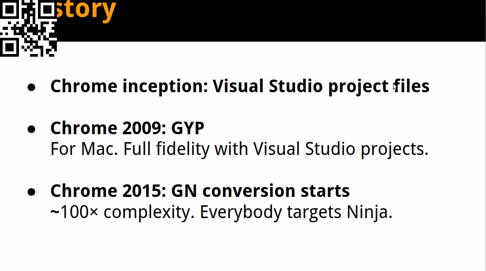
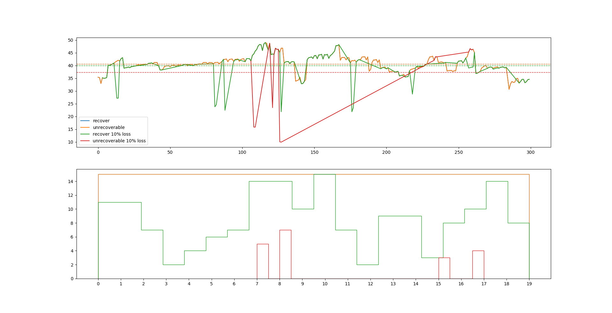

## 前言

在这篇文章里，主要解决如何对组播传屏SDK进行视频质量评估的问题。
之前写过一篇[文章](https://kb.cvte.com/pages/viewpage.action?pageId=133371447)，也分享过一些关于图像质量评估相关的算法（PSNR, SSIM, VMAF）。视频可以理解图片的集合，所以对视频质量的评估也可以转化为对图片质量的评估，只需要将源视频和需要评估的视频进行逐帧的对比就可以了。但在实际的场景下，由于编码，传输等过程的影响，会导致视频出现丢帧的情况，这时候对视频进行逐帧的对比会变的困难，因为你并不知道丢的是哪些帧，如果不处理丢帧的情况，依然按照从0开始逐帧的对比，会导致结果与实际值有比较大的出入，因为进行比较的帧可能不再是同一帧在传输前和传输后的结果了。还有一个问题，我们主观上对视频质量的感受，不仅受画质的影响，还受视频播放流畅度的影响，所以也需要有办法对视频的流畅度进行评估。

## 生成测试视频

测试前需要先有固定的测试视频，由于我们是对传屏效果进行测试，所以可以用ffmpeg录制一段时间的屏幕，并保存为YUV420P的格式。

``` shell
ffmpeg -f x11grab -t 20 -r 15 -s 1280x720 -i :0.0+0,200  -pix_fmt yuv420p out.yuv // Ubuntu系统

ffmpeg -f gdigrab -framerate 15 -offset_x 0 -offset_y 200 -video_size 1280x720 -i desktop  -pix_fmt yuv420p out.yuv // Windows系统
```

这里会生成一个帧率为15，分辨率为1280x720，时长为20秒，录制位置从桌面（0，200）坐标开始的 `YUV420p` 的视频。如果需要验证录制的视频是否可用，可以使用ffplay进行播放：

``` shell
ffplay -f rawvideo -video_size 1280*720 out.yuv 
```

## 对视频进行处理

回到我们刚才遇到的问题，我们现在在两段视频，一段是源视频，一段是经过传输后的，有丢帧的视频，那我们怎么让他们正确的进行逐帧的对比呢？一个好的办法是给每一帧都打个唯一的一个标识，我们的评估只在有相同标识的帧之前进行，这样就能避免对不是同一帧图片进行评估。新的问题来了，如何让标识能被程序识别到，因为YUV视频是不带额外的图像信息的，其存放的就只有每帧图像的内容，所以我们只能在图像里加标识，在图像左上角显示一个数字，从0开始计数，逐帧加1？这样感觉需要写一个能够识别数字图像的程序，从而把问题复杂化了，有没有通过简单编码（ctrl+c）就能解决问题的方法？受一段zoom和webrtc进行PK的视频的启发，我发现他们会在视频左上角打上二维码，这样的话我们只要为每帧图像都打上二维码，二维码的信息是唯一的，同时支持二维码的库也非常成熟，通过简单的编码（ctrl+v)就能进行生成和识别，所以决定使用这种方法。

我实现的工具的仓库为：https://github.com/shmilycode/video-quality-assessment

需要安装python3，还有一些库：

``` shell
pip3 install numpy opencv-python pyzbar scikit-image qrcode pillow
```

为视频逐帧打二维码，二维码信息从数字0开始，逐帧加1。

```
python3 qrhandler.py --videoname /mnt/f/code/video_set/sport.yuv --dimension 1280x720 --format I420
```

参数：

    videoname: 需要进行处理的视频名称，现只支持YUV格式视频文件

    dimension: 视频尺寸参数，如 "1280x720"

    format: 视频颜色格式，现只支持 "I420"

效果图：


## 视频质量评估

为了源视频后，我们将他用于我们的传屏SDK，将输入源设置为YUV文件，然后把接收端接收到的视频再次保存为YUV文件，这样我们就有了一对完整的对照视频，接下来就是对视频进行评估：

同样使用我开发的工具，你需要先写一个Json文件，json中包含的信息主要如下：

    raw_videos: 用于对比的原视频，一般是没有经过压缩或传输的效果较好的视频

    test_videos: 测试视频，一般是经过压缩或传输后的视频，信息有损坏，需要与原视频进行对比得出分析结果

    framerate: 原视频帧率，不是测试视频的帧率，因为测试视频可能由于丢帧等因素，导致帧率较低

    dimension: 视频尺寸参数，原视频和测试视频的尺寸应该是完全相同的,

    color_format: 视频颜色参数，原视频和测试视频相同，只支持 "I420"

    duration: 原视频在固定帧率下的播放时长

假设你保存为 `args.json`，接下来使用命令：

``` shell
python3 assess.py --input args.json
```

就可以生成一张包含了PSNR变化曲线和帧率变化曲线的图像。



图像由两个子图组成，上面的子图表示 `PSNR` 值在整个视频里的变化情况，`y` 轴表示PSNR值，`x` 轴0~300表示从0帧到第300帧。下面的子图表示帧率在每个播放时间里的变化情况，`y` 轴表示帧率，`x` 轴表示时间，0~19表示从第0秒到第19秒。

我们上面提到对视频播放流畅度的评估，这里通过第二张子图进行反映，因为帧率的变化会直接的表示为卡顿或流畅。

## 以上

关于为什么使用YUV做为输入和输出视频的格式，主要因为YUV是图像渲染的直接使用单位，我们喂给D3D渲染的格式就是YUV，我们从摄像头读出来的数据也是YUV，在发送端他更接近输入源，在接收端他也更接近输出源，当然使用YUV也有其他的问题，就是视频的大小会很大，超过500M是常态，如果你有其他的更好的方法可以跟我沟通下。